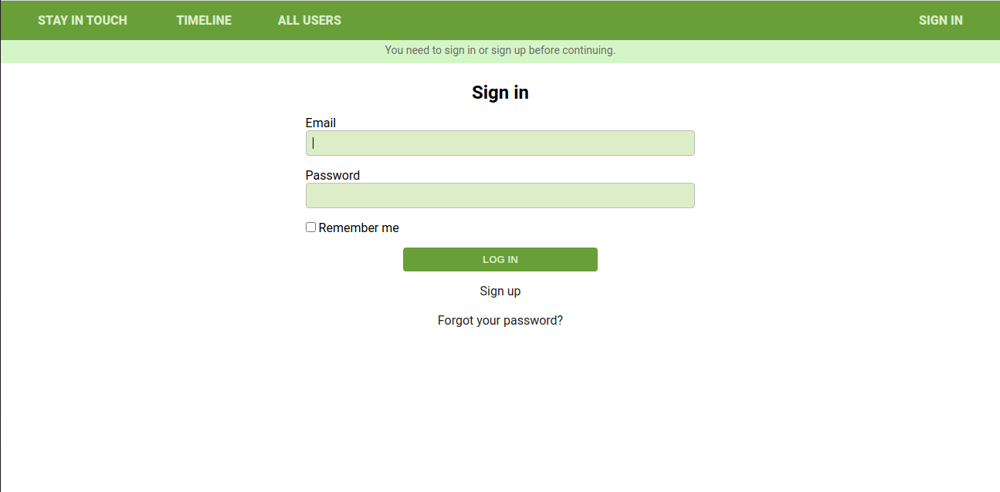

# Social media app with Ruby on Rails

> Welcome to our social media app. This project was built with `Ruby on Rails` and `PostgreSQL` in the back-end and `Sass` in the front-end. `Rspec` and `Capybara` were used in the testing phase and `Heroku` was used for deployment.



## Built With

- Ruby v2.7.2
- Ruby on Rails v5.2.4
- Rspec
- Linux
- Capybara
- Sass
- PostgreSQL

## Live Demo

Demo : [@Jarfsoft](http://ror-social-media-net.herokuapp.com/)


## Getting Started

To get a local copy up and running follow these simple example steps.

### Prerequisites

Ruby: 2.7.2
Rails: >=5.2.3
Postgres: >=9.5

### Setup

Instal gems with:

```
bundle install
```

Setup database with:

```
   rails db:create
   rails db:migrate
```

### Usage

Start server with:

```
    rails server
```

Open `http://localhost:3000/` in your browser.

### Run tests

```
    rpsec --format documentation
```

## Authors

👤 **Juan Raudales**

- Github : [@Jarfsoft](https://github.com/Jarfsoft)
- Twitter : [@Jarfsoft](https://twitter.com/Jarfsoft)
- Linkedin : [Jarfsoft](https://www.linkedin.com/in/juan-raudales-flores-7b0a3b113/)

👤 **Alvaro Ruiz**

- Github: [@alvarorf](https://github.com/alvarorf)
- Twitter: [@aaruizf](https://twitter.com/aaruizf)
- Linkedin: [Álvaro Ruiz](https://www.linkedin.com/in/alvaro-andr%C3%A9s-ruiz-florez/)

## 🤝 Contributing

Contributions, issues and feature requests are welcome!

Feel free to check the [issues page](issues/).

## Show your support

Give a ⭐️ if you like this project!

## 📝 License

MIT Open Source License

